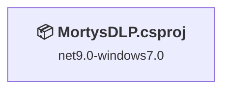
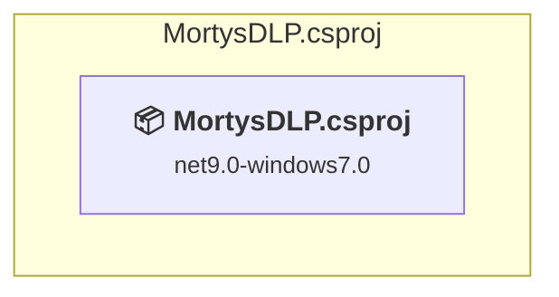

# Projects and dependencies analysis

This document provides a comprehensive overview of the projects and their dependencies in the context of upgrading to .NETCoreApp,Version=v10.0.

## Table of Contents

- [Executive Summary](#executive-Summary)
  - [Highlevel Metrics](#highlevel-metrics)
  - [Projects Compatibility](#projects-compatibility)
  - [Package Compatibility](#package-compatibility)
  - [API Compatibility](#api-compatibility)
- [Aggregate NuGet packages details](#aggregate-nuget-packages-details)
- [Top API Migration Challenges](#top-api-migration-challenges)
  - [Technologies and Features](#technologies-and-features)
  - [Most Frequent API Issues](#most-frequent-api-issues)
- [Projects Relationship Graph](#projects-relationship-graph)
- [Project Details](#project-details)

  - [MortysDLP.csproj](#mortysdlpcsproj)

## Executive Summary

### Highlevel Metrics

| Metric | Count | Status |
| :--- | :---: | :--- |
| Total Projects | 1 | All require upgrade |
| Total NuGet Packages | 1 | All compatible |
| Total Code Files | 24 |  |
| Total Code Files with Incidents | 20 |  |
| Total Lines of Code | 4700 |  |
| Total Number of Issues | 1675 |  |
| Estimated LOC to modify | 1674+ | at least 35,6% of codebase |

### Projects Compatibility

| Project | Target Framework | Difficulty | Package Issues | API Issues | Est. LOC Impact | Description |
| :--- | :---: | :---: | :---: | :---: | :---: | :--- |
| [MortysDLP.csproj](#mortysdlpcsproj) | net9.0-windows7.0 | 🟡 Medium | 0 | 1674 | 1674+ | Wpf, Sdk Style = True |

### Package Compatibility

| Status | Count | Percentage |
| :--- | :---: | :---: |
| ✅ Compatible | 1 | 100,0% |
| ⚠️ Incompatible | 0 | 0,0% |
| 🔄 Upgrade Recommended | 0 | 0,0% |
| ***Total NuGet Packages*** | ***1*** | ***100%*** |

### API Compatibility

| Category | Count | Impact |
| :--- | :---: | :--- |
| 🔴 Binary Incompatible | 1573 | High - Require code changes |
| 🟡 Source Incompatible | 74 | Medium - Needs re-compilation and potential conflicting API error fixing |
| 🔵 Behavioral change | 27 | Low - Behavioral changes that may require testing at runtime |
| ✅ Compatible | 4228 |  |
| ***Total APIs Analyzed*** | ***5902*** |  |

## Aggregate NuGet packages details

| Package | Current Version | Suggested Version | Projects | Description |
| :--- | :---: | :---: | :--- | :--- |
| Ookii.Dialogs.Wpf | 5.0.1 |  | [MortysDLP.csproj](#mortysdlpcsproj) | ✅Compatible |

## Top API Migration Challenges

### Technologies and Features

| Technology | Issues | Percentage | Migration Path |
| :--- | :---: | :---: | :--- |
| WPF (Windows Presentation Foundation) | 993 | 59,3% | WPF APIs for building Windows desktop applications with XAML-based UI that are available in .NET on Windows. WPF provides rich desktop UI capabilities with data binding and styling. Enable Windows Desktop support: Option 1 (Recommended): Target net9.0-windows; Option 2: Add <UseWindowsDesktop>true</UseWindowsDesktop>. |
| Legacy Configuration System | 70 | 4,2% | Legacy XML-based configuration system (app.config/web.config) that has been replaced by a more flexible configuration model in .NET Core. The old system was rigid and XML-based. Migrate to Microsoft.Extensions.Configuration with JSON/environment variables; use System.Configuration.ConfigurationManager NuGet package as interim bridge if needed. |
| Windows Forms | 12 | 0,7% | Windows Forms APIs for building Windows desktop applications with traditional Forms-based UI that are available in .NET on Windows. Enable Windows Desktop support: Option 1 (Recommended): Target net9.0-windows; Option 2: Add <UseWindowsDesktop>true</UseWindowsDesktop>; Option 3 (Legacy): Use Microsoft.NET.Sdk.WindowsDesktop SDK. |

### Most Frequent API Issues

| API | Count | Percentage | Category |
| :--- | :---: | :---: | :--- |
| T:System.Windows.Controls.TextBox | 102 | 6,1% | Binary Incompatible |
| T:System.Windows.Controls.TextBlock | 95 | 5,7% | Binary Incompatible |
| T:System.Windows.Controls.Button | 85 | 5,1% | Binary Incompatible |
| T:System.Windows.RoutedEventHandler | 84 | 5,0% | Binary Incompatible |
| T:System.Windows.Controls.CheckBox | 83 | 5,0% | Binary Incompatible |
| P:System.Windows.UIElement.IsEnabled | 69 | 4,1% | Binary Incompatible |
| P:System.Configuration.ApplicationSettingsBase.Item(System.String) | 64 | 3,8% | Source Incompatible |
| T:System.Windows.Controls.ComboBox | 52 | 3,1% | Binary Incompatible |
| P:System.Windows.Controls.Primitives.ToggleButton.IsChecked | 50 | 3,0% | Binary Incompatible |
| P:System.Windows.Controls.TextBox.Text | 49 | 2,9% | Binary Incompatible |
| T:System.Windows.MessageBoxResult | 46 | 2,7% | Binary Incompatible |
| T:System.Windows.MessageBoxImage | 43 | 2,6% | Binary Incompatible |
| T:System.Windows.MessageBoxButton | 43 | 2,6% | Binary Incompatible |
| T:System.Windows.RoutedEventArgs | 35 | 2,1% | Binary Incompatible |
| P:System.Windows.Controls.TextBlock.Text | 34 | 2,0% | Binary Incompatible |
| P:System.Windows.Controls.ContentControl.Content | 33 | 2,0% | Binary Incompatible |
| T:System.Windows.Threading.Dispatcher | 32 | 1,9% | Binary Incompatible |
| P:System.Windows.Threading.DispatcherObject.Dispatcher | 32 | 1,9% | Binary Incompatible |
| T:System.Windows.Controls.Label | 25 | 1,5% | Binary Incompatible |
| T:System.Windows.Controls.MenuItem | 21 | 1,3% | Binary Incompatible |
| E:System.Windows.Controls.Primitives.ButtonBase.Click | 20 | 1,2% | Binary Incompatible |
| T:System.Windows.MessageBox | 20 | 1,2% | Binary Incompatible |
| M:System.Windows.MessageBox.Show(System.String,System.String,System.Windows.MessageBoxButton,System.Windows.MessageBoxImage) | 19 | 1,1% | Binary Incompatible |
| T:System.Windows.Application | 18 | 1,1% | Binary Incompatible |
| M:System.Windows.Threading.Dispatcher.Invoke(System.Action) | 18 | 1,1% | Binary Incompatible |
| T:System.Windows.Visibility | 18 | 1,1% | Binary Incompatible |
| F:System.Windows.MessageBoxButton.OK | 16 | 1,0% | Binary Incompatible |
| P:System.Windows.Controls.Primitives.Selector.SelectedItem | 13 | 0,8% | Binary Incompatible |
| F:System.Windows.MessageBoxImage.Error | 12 | 0,7% | Binary Incompatible |
| M:System.Windows.Window.#ctor | 12 | 0,7% | Binary Incompatible |
| T:System.Windows.Window | 12 | 0,7% | Binary Incompatible |
| T:System.Windows.Controls.TextChangedEventHandler | 10 | 0,6% | Binary Incompatible |
| T:System.Windows.Controls.ProgressBar | 10 | 0,6% | Binary Incompatible |
| T:System.Windows.Controls.DataGrid | 9 | 0,5% | Binary Incompatible |
| T:System.Uri | 9 | 0,5% | Behavioral Change |
| T:System.Windows.Controls.ItemCollection | 9 | 0,5% | Binary Incompatible |
| P:System.Windows.Controls.ItemsControl.Items | 9 | 0,5% | Binary Incompatible |
| M:System.Uri.#ctor(System.String,System.UriKind) | 8 | 0,5% | Behavioral Change |
| M:System.Windows.Application.LoadComponent(System.Object,System.Uri) | 7 | 0,4% | Binary Incompatible |
| T:System.Windows.Media.RotateTransform | 7 | 0,4% | Binary Incompatible |
| M:System.Windows.Window.Close | 7 | 0,4% | Binary Incompatible |
| T:System.Windows.Forms.DialogResult | 7 | 0,4% | Binary Incompatible |
| T:System.Windows.Markup.IComponentConnector | 6 | 0,4% | Binary Incompatible |
| E:System.Windows.Controls.Primitives.ToggleButton.Unchecked | 6 | 0,4% | Binary Incompatible |
| E:System.Windows.Controls.Primitives.ToggleButton.Checked | 6 | 0,4% | Binary Incompatible |
| T:System.Windows.Media.Animation.RepeatBehavior | 6 | 0,4% | Binary Incompatible |
| F:System.Windows.MessageBoxResult.Yes | 6 | 0,4% | Binary Incompatible |
| M:System.Windows.Threading.Dispatcher.CheckAccess | 6 | 0,4% | Binary Incompatible |
| P:System.Windows.Controls.ItemsControl.ItemsSource | 5 | 0,3% | Binary Incompatible |
| E:System.Windows.Controls.Primitives.TextBoxBase.TextChanged | 5 | 0,3% | Binary Incompatible |

## Projects Relationship Graph

Legend:
📦 SDK-style project
⚙️ Classic project

## Project Details

### MortysDLP.csproj

#### Project Info

- **Current Target Framework:** net9.0-windows7.0
- **Proposed Target Framework:** net10.0-windows
- **SDK-style**: True
- **Project Kind:** Wpf
- **Dependencies**: 0
- **Dependants**: 0
- **Number of Files**: 33
- **Number of Files with Incidents**: 20
- **Lines of Code**: 4700
- **Estimated LOC to modify**: 1674+ (at least 35,6% of the project)

#### Dependency Graph

Legend:
📦 SDK-style project
⚙️ Classic project

### API Compatibility

| Category | Count | Impact |
| :--- | :---: | :--- |
| 🔴 Binary Incompatible | 1573 | High - Require code changes |
| 🟡 Source Incompatible | 74 | Medium - Needs re-compilation and potential conflicting API error fixing |
| 🔵 Behavioral change | 27 | Low - Behavioral changes that may require testing at runtime |
| ✅ Compatible | 4228 |  |
| ***Total APIs Analyzed*** | ***5902*** |  |

#### Project Technologies and Features

| Technology | Issues | Percentage | Migration Path |
| :--- | :---: | :---: | :--- |
| Legacy Configuration System | 70 | 4,2% | Legacy XML-based configuration system (app.config/web.config) that has been replaced by a more flexible configuration model in .NET Core. The old system was rigid and XML-based. Migrate to Microsoft.Extensions.Configuration with JSON/environment variables; use System.Configuration.ConfigurationManager NuGet package as interim bridge if needed. |
| Windows Forms | 12 | 0,7% | Windows Forms APIs for building Windows desktop applications with traditional Forms-based UI that are available in .NET on Windows. Enable Windows Desktop support: Option 1 (Recommended): Target net9.0-windows; Option 2: Add <UseWindowsDesktop>true</UseWindowsDesktop>; Option 3 (Legacy): Use Microsoft.NET.Sdk.WindowsDesktop SDK. |
| WPF (Windows Presentation Foundation) | 993 | 59,3% | WPF APIs for building Windows desktop applications with XAML-based UI that are available in .NET on Windows. WPF provides rich desktop UI capabilities with data binding and styling. Enable Windows Desktop support: Option 1 (Recommended): Target net9.0-windows; Option 2: Add <UseWindowsDesktop>true</UseWindowsDesktop>. |

